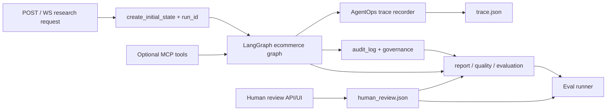

# EcomResearcher AgentOps + HITL + Eval Upgrade Design

Date: 2026-06-22

## Context

当前 `multi_agents/ecommerce` 已经具备一个可运行的 AI 选品研究链路：

- `multi_agents/ecommerce/state.py` 定义 `EcommerceResearchState`，已有 `research_plan`、`trend_result`、`competitor_result`、`review_result`、`opportunity_score`、`quality_check`、`audit_log`、`errors`、`output_paths`、`evaluation_summary`、`governance`。
- `multi_agents/ecommerce/graph.py` 使用 LangGraph `StateGraph` 编排 `planner -> {trend, competitor, review} -> scoring -> writer -> quality`，并通过 `progress_callback` 推送 `start`、`planner_done`、`research_running`、`research_done`、`scoring_done`、`report_done`、`quality_done`。
- `multi_agents/ecommerce/runtime/telemetry.py` 已有治理账本：`events`、`usage`、`budget_exceeded`、`degraded_by_budget`，并能汇总 failure、retry、fallback、policy、budget、usage、cost。
- `multi_agents/ecommerce/runner.py` 已经把 report、audit、quality、evaluation、log 落盘，并把路径回填到 `output_paths`。
- `multi_agents/ecommerce/evaluation.py` 已经能产出单次运行摘要，包括 `overall_score`、`confidence`、`evidence_count`、`fallback_count`、`duration_ms`、`scored_by`、`quality_passed` 和 governance 汇总。
- `backend/server/ecommerce_api.py` 已暴露 `POST /api/ecommerce/research` 与 `WS /ws/ecommerce`。
- `frontend/ecommerce.html` 和 `frontend/ecommerce-eval.html` 已经能展示运行结果与 demo case 指标。

上一轮设计和实现已经把研究节点从“只按 source_count 的硬规则”升级为“LLM 内容语义评分优先，规则兜底”。本设计不重做这部分，而是在现有实现上继续补齐三件能显著提高简历含金量的工程能力：

1. AgentOps trace：把一次选品研究的每个节点执行过程变成结构化、可回放、可定位问题的 trace。
2. Evaluation loop：把单次 demo 指标升级为可批量回归的 golden case 评估体系。
3. Human-in-the-loop：让人工能审查 plan、证据、分数和报告，并把人工反馈回流成评估样本。

## Goals

- 让每次选品运行有稳定的 `run_id`，并能从 API、WebSocket、输出文件和 evaluation 里贯穿追踪。
- 在现有 `audit_log` 和 `governance.events` 之上新增结构化 `agent_trace`，记录每个 LangGraph 节点的输入摘要、输出摘要、耗时、状态、证据数、分数、置信度、评分来源、warnings 和相关治理事件。
- 建立 `eval_cases` 数据集与批量评估入口，用固定案例衡量分数区间、引用覆盖、风险覆盖、降级率、LLM 评分率、质量检查、人工分歧等指标。
- 提供人工审查接口，让人可以批准或修改研究计划、标注证据质量、覆盖节点分数、标注报告问题。
- 把人工反馈导出为 evaluation 样本，使项目能讲清楚“人审 -> 数据集 -> 回归评估 -> 迭代优化”的闭环。
- 兼容当前 LangGraph 编排和 GPT Researcher 现有 LangChain/MCP 体系，MCP 作为额外 evidence/tool source 接入点，不成为第一期主路径。

## Non-Goals

- 第一阶段不做完整数据库、登录权限、团队协作后台、复杂审计权限模型。
- 第一阶段不替换当前静态 HTML 页面为完整 Next.js 电商工作台。
- 第一阶段不改变现有选品主链路的节点顺序和核心打分权重。
- 第一阶段不强依赖 LangSmith；如果环境变量已启用，可以挂接 trace URL，但本功能必须在无 LangSmith 时独立运行。
- 第一阶段不把 MCP 作为默认搜索源；MCP 只作为可选增强来源，失败时不得影响原搜索链路。

## Proposed Architecture

整体采用轻量扩展，而不是新建一套平台：



设计原则：

- 复用 `EcommerceResearchState` 作为主状态，新增字段不破坏已有消费者。
- 复用 `progress_callback` 推送 trace 增量，而不是另建 WebSocket。
- 复用 `output_paths` 管理落盘产物，把 `trace`、`human_review`、`eval_result` 加进去。
- 复用 `governance` 记录预算、降级、外部工具和策略事件，把 AgentOps trace 作为更面向调试和回放的结构化视角。
- 前端只加关键工作台页面或 panel，不做超出简历项目所需的后台产品化。

## State Schema Changes

在 `EcommerceResearchState` 和 `EcommerceGraphState` 中新增以下字段：

```python
run_id: str
agent_trace: list[dict[str, Any]]
human_review: dict[str, Any]
eval_result: dict[str, Any]
mcp_context: dict[str, Any]
```

`create_initial_state()` 负责生成 `run_id`，建议格式为：

```text
ecom_<yyyyMMddHHmmss>_<slug>_<shortid>
```

`agent_trace` 中每条记录使用统一 schema：

```json
{
  "run_id": "ecom_20260622143000_portable-blender_a1b2c3",
  "node": "trend",
  "agent": "TrendResearchAgent",
  "status": "success | partial | failed | skipped",
  "started_at_ms": 1782109800000,
  "ended_at_ms": 1782109812345,
  "duration_ms": 12345,
  "input_summary": {
    "query": "portable blender",
    "target_market": "US",
    "plan_queries": ["portable blender trend", "portable blender demand"]
  },
  "output_summary": {
    "source_count": 5,
    "confidence": 0.78,
    "scores": {
      "trend_score": 6.8
    },
    "scored_by": "llm"
  },
  "warnings": [],
  "error": "",
  "governance_event_refs": [3, 4]
}
```

`human_review` 使用按阶段分组的结构：

```json
{
  "review_status": "pending | approved | revised | rejected",
  "reviewer": "local_user",
  "updated_at_ms": 1782109900000,
  "plan_review": {
    "status": "approved",
    "edited_queries": {
      "trend_queries": ["portable blender demand 2026"]
    },
    "comment": "补充近期搜索意图"
  },
  "evidence_labels": [
    {
      "url": "https://example.com/source",
      "label": "relevant | weak | irrelevant | duplicate",
      "reason": "只讲 blender，不讲 portable blender"
    }
  ],
  "score_overrides": {
    "trend_score": {
      "value": 6.5,
      "reason": "来源显示需求有增长，但负面评论较多",
      "original_value": 7.4,
      "original_scored_by": "llm"
    }
  },
  "report_labels": ["citation_weak", "risk_missing"]
}
```

`eval_result` 用于单次运行参与 golden case 评估后的结果：

```json
{
  "case_id": "portable-blender-us-standard",
  "passed": true,
  "score": 0.86,
  "checks": {
    "trend_range": true,
    "competition_range": true,
    "pain_point_range": true,
    "must_have_risks": false,
    "min_citations": true,
    "quality_passed": true
  },
  "judge": {
    "used": true,
    "score": 0.8,
    "rationale": "结论大体由证据支持，但风险段缺少 battery safety"
  }
}
```

`mcp_context` 记录可选 MCP 工具配置和调用摘要：

```json
{
  "enabled": false,
  "strategy": "fast",
  "tool_calls": [
    {
      "server": "tavily-mcp",
      "tool": "search",
      "query": "portable blender consumer complaints",
      "status": "success",
      "result_count": 3
    }
  ]
}
```

## AgentOps Trace Design

新增 `multi_agents/ecommerce/runtime/trace_recorder.py`，提供三个职责：

1. `start_trace_node(state, node, agent, input_summary)`：创建 trace record 的开始时间和输入摘要。
2. `finish_trace_node(state, trace_id, status, output_summary, warnings, error)`：补齐结束时间、耗时、状态和输出摘要。
3. `emit_trace(progress_callback, trace_record)`：通过现有 WebSocket 回调发送 `trace_node_done` 事件。

`graph.py` 中每个节点 wrapper 调用 trace recorder：

- `planner_node` 记录 plan queries 数量和 risk focus。
- `trend_node` 记录 evidence 数量、`trend_score`、`confidence`、`scored_by`。
- `competitor_node` 记录 competitors 数量、`competition_score`、`confidence`、`scored_by`。
- `review_node` 记录 review source、review count、pain points、`pain_point_score`、`confidence`、`scored_by`。
- `scoring_node` 记录六维分数、overall、recommendation、`scored_by`。
- `writer_node` 记录 report 字符数、章节数量、引用数量。
- `quality_node` 记录 passed、citation coverage、issues。

当前 `graph.py` 里存在临时 `print(...)` debug 输出。该设计不要求立即做无关清理，但第一期实现 trace 时应把这些 stdout debug 收敛到 logger/trace，避免正式项目演示时输出不可结构化。

`runner.py` 新增落盘：

```text
outputs/ecommerce/<slug>-trace.json
```

并在 `output_paths` 增加：

```json
{
  "trace": "outputs/ecommerce/portable-blender-trace.json"
}
```

`evaluation_summary` 增加：

```json
{
  "run_id": "...",
  "trace_node_count": 7,
  "failed_node_count": 0,
  "partial_node_count": 0,
  "llm_scored_node_count": 4,
  "rule_scored_node_count": 0,
  "human_overridden_score_count": 0
}
```

## Evaluation Loop Design

新增目录：

```text
multi_agents/ecommerce/eval_cases/
  cases.jsonl
  README.md
```

每个 case 一行 JSON：

```json
{
  "case_id": "portable-blender-us-standard",
  "query": "portable blender",
  "target_market": "US",
  "platforms": ["amazon", "google"],
  "depth": "standard",
  "expected": {
    "trend_range": [6.0, 8.0],
    "competition_range": [4.0, 7.0],
    "pain_point_range": [6.0, 9.0],
    "overall_range": [5.5, 8.0],
    "must_have_risks": ["battery", "leakage"],
    "must_have_pain_points": ["cleaning", "battery"],
    "min_citations": 3,
    "max_fallback_count": 1
  }
}
```

新增 `multi_agents/ecommerce/eval_runner.py`：

- 读取 `cases.jsonl`。
- 调用 `run_ecommerce_research()` 批量运行。
- 对每个 case 产出 `eval_result`。
- 汇总成 `outputs/ecommerce/eval-runs/<run_id>/summary.json`。
- 可选把 manifest 写成当前 `frontend/ecommerce-eval.html` 可消费的 `case-index.json`。

评估维度：

- `score_range_match`：trend、competition、pain_point、overall 是否落入预期区间。
- `citation_coverage`：报告引用数量和 `quality_check.citation_coverage` 是否达标。
- `risk_coverage`：报告或 quality issues 是否覆盖 must-have risks。
- `pain_point_coverage`：review result 或报告是否覆盖 must-have pain points。
- `fallback_rate`：fallback 数是否低于阈值。
- `llm_score_rate`：研究节点和 scoring 节点中 `scored_by="llm"` 的比例。
- `evidence_support_judge`：可选 LLM-as-judge，判断结论是否由 evidence 支撑。
- `human_delta`：如果有人工覆盖，计算人审分数与原始 LLM 分数的差距。

`build_evaluation_summary()` 保持当前单次摘要能力，并新增从 `agent_trace`、`human_review`、`eval_result` 派生的字段。这样前端和 demo manifest 不需要一次性大改。

## Human-in-the-loop Design

人工接入分四个点，优先支持“运行后审查”，第二阶段再支持“运行中暂停审批”。

### 1. Plan Review

目标：人工查看和修改 `research_plan.*_queries`。

第一期实现方式：

- 运行结束后展示 planner 产出的 queries。
- 人工修改后保存到 `human_review.plan_review.edited_queries`。
- 该反馈进入 eval dataset，不立即重跑。

第二期增强：

- 在 `planner_done` 后暂停图执行，等待人工 approve/revise。
- 需要在 LangGraph 节点间加入 interrupt/resume 机制，复杂度高，暂不放入第一期。

### 2. Evidence Review

目标：人工标注 source 是否相关、是否重复、是否证据薄弱。

第一期实现方式：

- 前端读取 `trend_result.evidence`、`competitor_result.evidence`、`review_result.evidence`。
- 用户对 source 打 `relevant | weak | irrelevant | duplicate`。
- 保存到 `human_review.evidence_labels`。
- `evaluation_summary` 派生 `human_irrelevant_source_count` 和 `human_weak_source_count`。

### 3. Score Review

目标：人工覆盖分数，解决“LLM 看起来过度乐观/悲观”的场景。

支持覆盖字段：

- `trend_score`
- `competition_score`
- `pain_point_score`
- `margin_score`
- `risk_score`
- `overall_score`

覆盖不直接抹掉原始分数，而是保留：

- 原始 value。
- 原始 `scored_by`。
- human value。
- reason。

展示层可以把最终口径标记为：

```json
{
  "display_score": 6.5,
  "display_scored_by": "human",
  "original_scored_by": "llm"
}
```

这样简历中可以清楚表达：系统支持自动评分，也支持人审覆盖和差异分析。

### 4. Report Review

目标：人工标注报告缺陷，作为质量评估和 prompt 优化的数据。

标签集合：

- `citation_weak`
- `risk_missing`
- `overconfident`
- `evidence_mismatch`
- `market_unclear`
- `actionability_weak`

保存后进入 `human_review.report_labels`，并可导出为 eval case 的 expected constraints。

## API Design

扩展现有 `backend/server/ecommerce_api.py`。

`POST /api/ecommerce/research` 请求新增可选字段：

```json
{
  "mcp_enabled": false,
  "mcp_strategy": "fast",
  "mcp_configs": [],
  "trace_enabled": true
}
```

响应 `_summarize()` 新增：

```json
{
  "run_id": "...",
  "agent_trace": [],
  "evaluation_summary": {},
  "human_review": {},
  "eval_result": {},
  "mcp_context": {}
}
```

`WS /ws/ecommerce` 新增事件：

```json
{
  "event": "trace_node_done",
  "run_id": "...",
  "node": "trend",
  "status": "success",
  "duration_ms": 12000,
  "output_summary": {}
}
```

新增轻量人审接口：

```text
GET  /api/ecommerce/runs/{run_id}
POST /api/ecommerce/runs/{run_id}/human-review
POST /api/ecommerce/eval/run
GET  /api/ecommerce/eval/runs/{eval_run_id}
```

第一期不引入数据库，`GET /runs/{run_id}` 从 `outputs/ecommerce` 根据 manifest 或文件名读取。为了让读取稳定，runner 需要额外写：

```text
outputs/ecommerce/<slug>-run.json
```

其中包含 `run_id`、query、market、output_paths、summary。后续如果要产品化，再迁移到 SQLite 或 Postgres。

## Frontend Design

保留静态 HTML 路线，新增或扩展三个页面：

1. `frontend/ecommerce.html`
   - 增加 run_id 展示。
   - 增加 Agent Trace panel，按节点展示状态、耗时、分数、scored_by、source_count、warnings。
   - WebSocket 收到 `trace_node_done` 时实时追加节点记录。

2. `frontend/ecommerce-review.html`
   - 输入或选择 run_id。
   - 展示 plan、sources、scores、report。
   - 支持 evidence label、score override、report labels。
   - 保存到 `/api/ecommerce/runs/{run_id}/human-review`。

3. `frontend/ecommerce-eval.html`
   - 复用现有 demo case dashboard。
   - 增加 eval run summary、pass rate、range match、risk coverage、fallback rate、human delta。
   - 读取 `outputs/ecommerce/eval-runs/<eval_run_id>/summary.json` 或后端 API。

前端不做复杂路由和权限，目标是把工程闭环演示清楚：运行、追踪、人审、评估。

## LangGraph / LangChain / MCP Compatibility

### LangGraph

当前 `graph.py` 的 LangGraph fork-join 结构继续保留。Trace recorder 只包裹节点，不改变节点业务职责：

- graph 仍负责编排。
- agent 仍负责产出业务结果。
- trace recorder 只负责结构化记录。

如果后续实现运行中 HITL，可考虑 LangGraph interrupt/resume 或 checkpointer；第一期只做运行后 review，避免引入较重的状态恢复复杂度。

### LangChain / LangSmith

GPT Researcher 已经支持 LangChain 生态，`multi_agents/main.py` 也有 LangSmith 环境变量逻辑。电商链路第一期只需要：

- 在 `run_id` 存在时，把它写入 logger、trace、evaluation。
- 如果 `LANGCHAIN_TRACING_V2=true` 且能拿到 LangSmith run/thread 信息，则在 `evaluation_summary` 增加 `langsmith_url`。
- 没有 LangSmith 时不影响运行。

### MCP

项目里已有 MCP 能力：

- `gpt_researcher/retrievers/mcp/retriever.py`
- `gpt_researcher/mcp/*`
- `frontend/nextjs/components/Settings/MCPSelector.tsx`
- 常规研究接口已能传 `mcp_enabled`、`mcp_strategy`、`mcp_configs`

电商链路不直接复用完整 GPTResearcher researcher 实例，因此第一期 MCP 设计为适配层：

```text
MCP tool result -> EcommerceSource -> existing research node evidence
```

新增可选 `mcp_search_fn` 或 `make_mcp_augmented_search_fn()`：

- 输入 query、max_results、mcp configs。
- 调用 MCP 工具或 MCP retriever 适配器。
- 将返回结果规范化为 `EcommerceSource`：
  - `title`
  - `url`
  - `source_type="mcp"`
  - `snippet`
  - `content`
  - `tool_name`
  - `server_name`
- 每次 MCP 调用写入 `governance`：
  - `external_api_call_count`
  - `kind="tool"`
  - `agent`
  - `detail`
- 同时写入 `mcp_context.tool_calls`。

MCP 失败时：

- 记录 warning 和 governance failure/fallback。
- 返回空 MCP 结果。
- 保持默认 search_fn 继续工作。

这样可以在简历中讲清楚：“项目兼容 MCP 外部工具生态，但没有把核心链路绑死在某个工具服务上。”

## Persistence Design

单次运行输出文件：

```text
outputs/ecommerce/<slug>-report.md
outputs/ecommerce/<slug>-audit.json
outputs/ecommerce/<slug>-quality.json
outputs/ecommerce/<slug>-evaluation.json
outputs/ecommerce/<slug>-trace.json
outputs/ecommerce/<slug>-human-review.json
outputs/ecommerce/<slug>-run.json
logs/ecommerce/<timestamp>_<slug>.log
```

批量评估输出文件：

```text
outputs/ecommerce/eval-runs/<eval_run_id>/summary.json
outputs/ecommerce/eval-runs/<eval_run_id>/cases.json
outputs/ecommerce/eval-runs/<eval_run_id>/case-index.json
```

`run.json` 作为无数据库阶段的索引文件：

```json
{
  "run_id": "...",
  "query": "portable blender",
  "target_market": "US",
  "created_at_ms": 1782109800000,
  "output_paths": {},
  "evaluation_summary": {}
}
```

## Testing Strategy

新增或扩展测试：

1. `tests/test_ecommerce_trace.py`
   - `create_initial_state()` 生成 `run_id`。
   - 每个节点成功后写入 `agent_trace`。
   - 节点 partial/failure 时 trace 状态正确。
   - `trace_node_done` 会通过 fake progress callback 发出。

2. `tests/test_ecommerce_evaluation.py`
   - golden case range match。
   - must-have risks / pain points 覆盖。
   - fallback rate 和 llm score rate 汇总。
   - human override delta 汇总。

3. `tests/test_ecommerce_human_review.py`
   - 保存 human review JSON。
   - score override 不覆盖原始 score。
   - report labels 能进入 evaluation summary。

4. `tests/test_ecommerce_api.py`
   - POST 返回 `run_id`、`agent_trace`、`evaluation_summary`。
   - WebSocket 推送 `trace_node_done`。
   - human review API 能读写文件。

5. `tests/test_ecommerce_mcp_adapter.py`
   - MCP 结果能规范化为 `EcommerceSource`。
   - MCP 失败不会中断默认搜索。
   - MCP 调用会写入 governance usage 和 `mcp_context`。

回归命令沿用当前项目习惯：

```bash
py -m pytest tests/test_ecommerce_agents.py tests/test_ecommerce_runner.py tests/test_ecommerce_evaluation.py -q
```

新增功能完成后追加对应新测试文件。

## Implementation Phases

### Phase 1: AgentOps Trace

- 增加 `run_id` 和 `agent_trace`。
- 增加 trace recorder。
- 包裹 LangGraph 节点。
- runner 落盘 `trace.json` 和 `run.json`。
- API 和 WebSocket 返回 trace。
- 前端主页面展示 trace panel。

### Phase 2: Evaluation Loop

- 增加 `eval_cases/cases.jsonl`。
- 增加 eval runner。
- 扩展 `build_evaluation_summary()`。
- 扩展 eval dashboard。
- 加入 golden case 回归测试。

### Phase 3: Human Review

- 增加 `human_review` 数据结构和落盘文件。
- 增加人审 API。
- 新增 `ecommerce-review.html`。
- 将 human labels 和 score overrides 汇总进 evaluation。
- 支持从 human review 导出 eval case expected constraints。

### Phase 4: Optional MCP Evidence

- 增加 MCP search adapter。
- 将 MCP tool result 规范化为 `EcommerceSource`。
- 将 MCP usage 写入 governance 和 trace。
- API 请求支持 `mcp_enabled`、`mcp_strategy`、`mcp_configs`。

## Resume Value

这个升级能把项目从“调用 LLM 生成报告”提升成“可观测、可评估、可人工校准的 AI Agent 工程系统”。简历上可以强调：

- 基于 LangGraph 构建多 Agent 并发研究工作流，覆盖 planner、trend、competitor、review、scoring、writer、quality。
- 设计 AgentOps trace 层，实现 run_id 贯穿、节点级耗时/状态/证据/分数/降级追踪。
- 建立 LLM 应用评估体系，用 golden cases、LLM-as-judge、引用覆盖、风险覆盖、fallback rate 做回归评估。
- 引入 Human-in-the-loop，把人工标注、分数覆盖和报告问题标签回流到评估数据集。
- 兼容 LangChain/MCP 工具体系，可将外部工具结果规范化为统一 evidence schema，并通过 governance 记录成本和降级。
- 保持工程可落地：复用现有 state、runner、WebSocket、frontend，不以大而全后台掩盖核心 Agent 工程能力。

## Acceptance Criteria

- 一次运行能生成稳定 `run_id`，并在 API 响应、WebSocket 事件、evaluation、trace 文件中一致出现。
- `trace.json` 至少包含 planner、trend、competitor、review、scoring、writer、quality 七个节点记录。
- `evaluation_summary` 能区分 LLM scored、rule fallback、human override。
- 至少三个 golden cases 可批量运行，并产出 pass rate 和每 case 失败原因。
- 人工能保存 evidence labels、score overrides、report labels，并能在 evaluation 中看到影响。
- MCP 关闭时行为与当前链路一致；MCP 开启失败时不阻断默认搜索。
- 新增测试覆盖 trace、eval、human review 和 MCP adapter 的核心路径。
