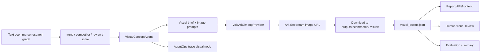

# EcomResearcher Visual Concept Agent Design

Date: 2026-06-23

## Context

当前 `multi_agents/ecommerce` 已经具备完整的文本选品研究链路：

- `graph.py` 使用 LangGraph 编排 `planner -> {trend, competitor, review} -> scoring -> writer -> quality`。
- `runner.py` 已能落盘 report、audit、quality、evaluation、trace、human review、run metadata。
- `runtime/trace_recorder.py` 已能记录节点级 AgentOps trace，并通过 WebSocket 推送 `trace_node_done`。
- `eval_runner.py` 已支持 golden case 批量评估，并把 `eval_result` 回写到单次运行 artifact。
- `mcp_adapter.py` 已支持可选 MCP evidence 增强、失败降级、调用摘要和敏感信息脱敏。
- 前端已有 `frontend/ecommerce.html`、`frontend/ecommerce-review.html`、`frontend/ecommerce-eval.html` 三个静态页面，能展示研究结果、人审和评估。

这说明 AgentOps、HITL、eval、MCP 已经是底座。下一阶段最有简历展示价值的增强，不是继续堆治理字段，而是把选品研究扩展成多模态能力：让系统能把趋势、竞品缺口和评论痛点转化为产品概念图与 Amazon Listing 视觉草案。

已验证火山方舟图片生成链路：

- SDK 包：`volcengine-python-sdk[ark]`
- Python import：`from volcenginesdkarkruntime import Ark`
- Base URL：`https://ark.cn-beijing.volces.com/api/v3`
- 默认模型：`doubao-seedream-4-5-251128`
- 备选升级模型：`doubao-seedream-5-0-260128`
- 第一版输入：纯文本 prompt
- 第一版输出：临时图片 URL，需要下载到本地 artifact，避免 URL 过期
- `doubao-seedream-4-5-251128` 不支持 `output_format`
- `doubao-seedream-5-0-260128` 支持 `output_format="png"`，但成本更高，不作为默认

## Goals

- 新增 `VisualConceptAgent`，把文本选品研究结果转化为可展示、可追踪、可审核的视觉产物。
- 第一版同时生成两类视觉资产：
  1. 产品概念图：产品外观、使用场景、差异化细节。
  2. Amazon Listing 图：主图构图、卖点信息图、生活方式场景图。
- 真实接入火山方舟即梦模型，默认使用较便宜的 `doubao-seedream-4-5-251128`。
- 保留 provider 抽象，让未来能切换 `doubao-seedream-5-0-260128` 或其他图片模型。
- 图片生成失败时降级为 prompt-only，不阻断文本选品主链路。
- 将图片生成纳入现有 AgentOps trace、evaluation summary、human review 和 run artifacts。
- 前端能展示图片、prompt、生成理由、来源证据摘要和人工审核状态。

## Non-Goals

- 第一版不做图生图、参考图、竞品图视觉理解或图片编辑。
- 第一版不做复杂素材库、团队协作、图片版本管理或 CDN 上传。
- 第一版不接入付费成本精算，只记录 usage 中可获得的 token/image 数和耗时。
- 第一版不把图片作为选品评分的硬输入，避免图像审美反向污染市场判断。
- 第一版不把 Next.js 前端重构作为必要条件，优先扩展现有静态页面。
- 第一版不保存 API key 到仓库、配置文件或 artifact。

## Proposed Architecture



设计原则：

- `VisualConceptAgent` 负责业务语义：读选品证据，产出视觉 brief、prompt、生成理由、资产类型。
- `VolcArkJimengProvider` 负责厂商调用：SDK 初始化、参数兼容、下载图片、返回 metadata。
- `runner.py` 负责 orchestration：决定是否启用视觉生成、落盘 artifact、把路径写入 `output_paths`。
- `evaluation.py` 只汇总视觉指标，不判断图片审美优劣。
- `human_review` 承担人工视觉审核，记录图片是否可用和原因。

第一版不把 visual node 放进 LangGraph 主图的 fork-join 结构，而是在 graph 完成、质量检查之后由 runner 调用。原因：

- 视觉生成依赖完整的 trend、competitor、review、score 和 report context。
- 图像模型耗时和成本更高，放在 runner 后置阶段更容易开关控制和失败降级。
- 不改变现有 LangGraph 主链路，降低回归风险。
- 仍然通过 `agent_trace` 追加一个 `visual` 节点，保持 AgentOps 视角完整。

## Configuration

新增环境变量：

```text
ARK_API_KEY=<火山方舟 API key>
ECOMMERCE_VISUAL_ENABLED=true
ECOMMERCE_VISUAL_MODEL=doubao-seedream-4-5-251128
ECOMMERCE_VISUAL_SIZE=2K
ECOMMERCE_VISUAL_WATERMARK=false
ECOMMERCE_VISUAL_IMAGE_COUNT=6
```

默认值：

- `ECOMMERCE_VISUAL_ENABLED=false`
- `ECOMMERCE_VISUAL_MODEL=doubao-seedream-4-5-251128`
- `ECOMMERCE_VISUAL_SIZE=2K`
- `ECOMMERCE_VISUAL_WATERMARK=false`
- `ECOMMERCE_VISUAL_IMAGE_COUNT=6`

API 请求可以覆盖配置：

```json
{
  "visual_enabled": true,
  "visual_model": "doubao-seedream-4-5-251128",
  "visual_image_count": 6
}
```

安全要求：

- 只从环境变量读取 `ARK_API_KEY`。
- API 响应、trace、evaluation、human review、logs 中不得出现 key。
- 调用异常写入 artifact 前必须走 `redact_secrets()`。
- 用户在对话或本地测试中暴露过 key 后，建议在火山控制台轮换。

## State Schema

`EcommerceResearchState` 新增：

```python
visual_result: dict[str, Any]
```

初始值：

```json
{
  "enabled": false,
  "status": "skipped",
  "visual_brief": {},
  "prompts": [],
  "assets": [],
  "warnings": [],
  "usage": {}
}
```

`visual_result` 完整结构：

```json
{
  "enabled": true,
  "status": "success | partial | failed | skipped",
  "model": "doubao-seedream-4-5-251128",
  "provider": "volcengine_ark_jimeng",
  "visual_brief": {
    "product_positioning": "面向通勤和健身场景的便携榨汁机",
    "target_customer": "注重便携和清洗效率的年轻上班族",
    "design_direction": "透明杯身、可拆洗刀头、防漏杯盖、轻量化底座",
    "differentiation": ["一键自清洁", "防漏结构", "便携挂绳"],
    "risk_notes": ["避免暗示医疗功效", "避免出现知名品牌 logo"]
  },
  "prompts": [
    {
      "asset_id": "visual_product_01",
      "kind": "product_concept",
      "slot": "appearance",
      "prompt": "中文或英文图片生成 prompt",
      "negative_prompt": "品牌 logo, 医疗宣称, 文字水印, 夸张变形",
      "reason": "来自评论痛点：清洗困难和漏液风险",
      "source_refs": ["review_result.pain_points[0]", "competitor_result.gaps[1]"]
    }
  ],
  "assets": [
    {
      "asset_id": "visual_product_01",
      "kind": "product_concept",
      "slot": "appearance",
      "status": "success",
      "prompt": "...",
      "reason": "...",
      "remote_url": "https://ark-...tos...",
      "local_path": "outputs/ecommerce/portable-blender-visual/visual_product_01.png",
      "mime_type": "image/png",
      "width": 2048,
      "height": 2048,
      "model": "doubao-seedream-4-5-251128",
      "duration_ms": 8300,
      "usage": {
        "generated_images": 1,
        "output_tokens": 16384,
        "total_tokens": 16384
      },
      "warning": ""
    }
  ],
  "warnings": [],
  "usage": {
    "generated_images": 6,
    "total_tokens": 98304,
    "failed_images": 0
  }
}
```

## Visual Asset Plan

默认生成 6 张图：

1. `product_concept / appearance`
   - 产品外观概念图。
   - 强调形态、材质、差异化结构。

2. `product_concept / use_case`
   - 使用场景图。
   - 展示目标用户和真实场景，例如通勤、健身、厨房、户外。

3. `product_concept / detail`
   - 差异化细节图。
   - 展示防漏结构、易清洗刀头、收纳设计等。

4. `listing / main_image`
   - Amazon 主图草案。
   - 白底、产品清晰、无额外文案、无品牌 logo。

5. `listing / infographic`
   - 卖点信息图草案。
   - 可以包含简单图形布局概念，但第一版 prompt 应避免要求模型生成大量可读文字，因为图片模型中文字容易失真。

6. `listing / lifestyle`
   - 生活方式场景图。
   - 展示目标人群和使用场景，避免医疗、夸大功效和平台违规暗示。

如果 `visual_image_count < 6`：

- 1 张：只生成 `listing/main_image`
- 3 张：生成 `product_concept/appearance`、`listing/main_image`、`listing/lifestyle`
- 6 张：生成完整默认计划

如果 `visual_image_count > 6`：

- 第一版上限仍为 6，避免成本不可控。

## Prompt Generation

新增 `multi_agents/ecommerce/agents/visual_concept.py`。

核心函数：

```python
async def run_visual_concept_agent(
    state: EcommerceResearchState,
    *,
    image_provider: ImageGenerationProvider | None = None,
    visual_enabled: bool = False,
    visual_model: str = "doubao-seedream-4-5-251128",
    image_count: int = 6,
) -> EcommerceResearchState:
    ...
```

第一版 prompt 生成使用规则模板，不强依赖 LLM：

- 从 `trend_result.summary/key_findings` 抽取市场方向。
- 从 `competitor_result.gaps` 或 summary 抽取差异化机会。
- 从 `review_result.pain_points` 抽取用户痛点。
- 从 `opportunity_score.risks/recommendation` 抽取限制和风险。

如果后续传入 `llm_fn`，可以让 LLM 优化 prompt，但第一版不要把视觉链路强依赖第二次 LLM 调用。

Prompt 模板原则：

- 明确图片用途：产品概念图 / Amazon 主图 / 卖点图 / 场景图。
- 明确视觉约束：材质、背景、灯光、视角、构图。
- 明确平台合规：无品牌 logo、无医疗功效、无夸大承诺、少文字。
- 明确证据来源：为什么强调某个卖点。
- 保持 prompt 可审计，写入 artifact。

示例 prompt：

```text
一张高质量电商产品概念图，展示一款便携式榨汁机，透明杯身，可拆洗刀头，防漏杯盖，轻量化底座。
产品定位：面向通勤和健身场景，强调易清洗、防漏、便携。
视觉风格：真实产品摄影，柔和自然光，干净高级，细节清晰，白色到浅灰背景。
构图：三分之二正面角度，旁边展示可拆卸部件，但不要出现品牌 logo。
限制：不要医疗功效宣称，不要夸张变形，不要水印，不要复杂文字。
```

## Image Provider Design

新增目录：

```text
multi_agents/ecommerce/tools/image_generation/
  __init__.py
  base.py
  volc_ark_jimeng.py
```

`base.py`：

```python
from dataclasses import dataclass
from typing import Protocol

@dataclass
class ImageGenerationRequest:
    asset_id: str
    prompt: str
    model: str
    size: str = "2K"
    watermark: bool = False

@dataclass
class ImageGenerationResult:
    asset_id: str
    status: str
    remote_url: str
    local_path: str
    width: int
    height: int
    model: str
    duration_ms: int
    usage: dict
    warning: str = ""

class ImageGenerationProvider(Protocol):
    async def generate(self, request: ImageGenerationRequest) -> ImageGenerationResult:
        ...
```

`volc_ark_jimeng.py`：

- 使用 `volcenginesdkarkruntime.Ark`。
- 从 `ARK_API_KEY` 或 `VOLCENGINE_ARK_API_KEY` 读取 key。
- 默认 `base_url="https://ark.cn-beijing.volces.com/api/v3"`。
- 对 `doubao-seedream-4-5-251128` 不传 `output_format`。
- 对支持输出格式的模型可以传 `output_format="png"`，但需要显式模型能力判断。
- 使用 `response_format="url"`。
- 下载远程 URL 到本地 visual output dir。
- 解析尺寸：
  - SDK 返回 `data[0].size` 时解析 `2048x2048`。
  - 没有 size 时使用 Pillow 读取本地图片尺寸。
- 记录 usage：
  - `generated_images`
  - `output_tokens`
  - `total_tokens`

失败策略：

- key 缺失：返回 `status="failed"`，warning 为 `missing ARK_API_KEY`，不抛出到主链路。
- API 超时：返回 failed asset，保留 prompt。
- 模型参数错误：记录 redacted error。
- 下载失败：记录 failed asset，保留 remote URL。

## Runner Integration

`run_ecommerce_research()` 新增参数：

```python
visual_enabled: bool = False
visual_model: str = "doubao-seedream-4-5-251128"
visual_image_count: int = 6
image_provider: ImageGenerationProvider | None = None
```

执行顺序：

1. 创建初始 state。
2. 跑现有 LangGraph 文本研究。
3. 计算 report、quality、evaluation 的原有内容。
4. 如果 `visual_enabled=True`：
   - 调用 `run_visual_concept_agent()`。
   - 追加 `agent_trace` 的 `visual` 节点。
   - 写出 visual artifacts。
5. 如果视觉生成失败：
   - `visual_result.status="partial"` 或 `failed`。
   - 保留 `prompts`。
   - 主报告和文本 artifacts 仍正常落盘。

新增输出路径：

```json
{
  "visual_assets": "outputs/ecommerce/portable-blender-visual/visual-assets.json",
  "visual_dir": "outputs/ecommerce/portable-blender-visual"
}
```

目录结构：

```text
outputs/ecommerce/<slug>-visual/
  visual-assets.json
  visual_product_01.png
  visual_product_02.png
  visual_product_03.png
  visual_listing_01.png
  visual_listing_02.png
  visual_listing_03.png
```

## AgentOps Integration

视觉节点 trace：

```json
{
  "node": "visual",
  "agent": "VisualConceptAgent",
  "status": "success | partial | failed | skipped",
  "input_summary": {
    "query": "portable blender",
    "model": "doubao-seedream-4-5-251128",
    "requested_image_count": 6,
    "trend_score": 6.8,
    "overall_score": 6.6
  },
  "output_summary": {
    "prompt_count": 6,
    "generated_image_count": 6,
    "failed_image_count": 0,
    "total_tokens": 98304
  },
  "warnings": []
}
```

Governance usage 增加：

```json
{
  "image_generation_call_count": 6,
  "generated_image_count": 6
}
```

如果暂时不改 `telemetry.py` 的固定 summary，也可以先把视觉 usage 放进 `visual_result.usage` 和 `evaluation_summary`，第二阶段再统一 governance counters。

## Evaluation Integration

`build_evaluation_summary()` 增加：

```json
{
  "visual_enabled": true,
  "visual_status": "success",
  "visual_prompt_count": 6,
  "visual_asset_count": 6,
  "visual_failed_asset_count": 0,
  "visual_total_tokens": 98304,
  "visual_approved_count": 0,
  "visual_rejected_count": 0
}
```

Golden case 第一版不把视觉图像质量作为 pass/fail 硬门槛，只检查：

- 启用视觉生成时至少产出 prompt。
- 如果有 key 和 provider 可用，至少一张图片成功。
- 失败时必须保留 prompt-only artifact。

未来可以加 LLM-as-judge 或人工评分：

- prompt 是否覆盖 must-have pain points。
- 图片是否符合 Amazon 主图约束。
- 图片是否存在明显品牌侵权、医疗暗示、文字乱码。

## Human Review Integration

`human_review` 新增：

```json
{
  "visual_reviews": [
    {
      "asset_id": "visual_product_01",
      "status": "approved | rejected | needs_edit",
      "reason": "卖点清晰，但产品结构不够真实",
      "tags": ["too_futuristic", "good_differentiation"]
    }
  ]
}
```

标签建议：

- `approved`
- `too_generic`
- `too_futuristic`
- `too_similar_to_competitors`
- `violates_listing_rules`
- `text_artifact`
- `good_differentiation`
- `needs_prompt_edit`

人审不直接删除图片，而是覆盖展示状态和 evaluation summary：

- `visual_approved_count`
- `visual_rejected_count`
- `visual_needs_edit_count`

## API Design

`EcommerceRequest` 新增：

```python
visual_enabled: bool = False
visual_model: str = "doubao-seedream-4-5-251128"
visual_image_count: int = 6
```

`POST /api/ecommerce/research` 和 `WS /ws/ecommerce` 都必须透传这些字段。

`_summarize()` 新增：

```json
{
  "visual_result": {},
  "visual_assets": [],
  "output_paths": {
    "visual_assets": "...",
    "visual_dir": "..."
  }
}
```

`GET /api/ecommerce/runs/{run_id}` 读取 run artifacts 时，也应返回 `visual_result`。

未来可以增加静态文件服务，让前端能通过 `/outputs/...png` 直接展示本地图片。第一版如果现有 FastAPI 没有输出目录静态挂载，则前端可以展示 remote URL；但 artifact 必须保存 local path，为 URL 过期后的回放做准备。

## Frontend Design

扩展 `frontend/ecommerce.html`：

- 请求表单增加：
  - `生成视觉概念图` checkbox
  - 图片数量 select：`1 / 3 / 6`
  - 模型展示：默认 `doubao-seedream-4-5-251128`
- 结果区增加 `Visual Concepts` panel：
  - 图片网格
  - 类型 badge：product concept / listing
  - slot badge：appearance / use_case / detail / main_image / infographic / lifestyle
  - prompt 折叠区
  - reason / source refs
  - status / warning
- 如果只有 prompt，没有图片：
  - 显示 prompt-only 卡片
  - warning 文案：图片生成失败，但视觉 brief 已生成

扩展 `frontend/ecommerce-review.html`：

- 增加视觉资产审核：
  - approve
  - reject
  - needs edit
  - reason input
  - tags multi-select

扩展 `frontend/ecommerce-eval.html`：

- 展示视觉指标：
  - visual status
  - prompt count
  - image count
  - failed image count
  - approved/rejected count

前端视觉原则：

- 图片是结果展示核心，不放在过小的卡片里。
- Listing 主图和产品概念图需要清晰区分，避免用户误以为概念图就是可直接上架素材。
- 不在页面上暴露 API key、完整远程签名 URL 的 query 参数；展示图片即可，metadata 折叠。

## Error Handling

视觉生成可能失败，但不能影响主研究结果。

失败类型：

1. `visual_disabled`
   - 用户未启用视觉生成。
   - `visual_result.status="skipped"`。

2. `missing_api_key`
   - 未设置 `ARK_API_KEY` 或 `VOLCENGINE_ARK_API_KEY`。
   - 保留 prompts，assets 为空或 failed。

3. `provider_error`
   - SDK 抛异常、模型参数错误、额度不足。
   - 单图失败不影响其他图。

4. `download_error`
   - 图片 URL 返回成功，但下载本地失败。
   - 保留 remote_url 和 warning。

5. `partial_success`
   - 部分图片成功，部分失败。
   - `visual_result.status="partial"`。

所有错误信息写入 artifact 前必须脱敏。

## Testing Strategy

新增测试：

1. `tests/test_ecommerce_visual_agent.py`
   - 根据 fake state 生成 6 个 prompts。
   - `visual_image_count=1/3/6` 时 slot 选择正确。
   - provider 失败时保留 prompt-only artifact。
   - visual trace summary 正确。

2. `tests/test_ecommerce_image_provider.py`
   - fake Ark client 返回 URL 时，provider 下载并写本地文件。
   - `doubao-seedream-4-5-251128` 不传 `output_format`。
   - missing key 返回 failed result。
   - provider 异常会脱敏。

3. `tests/test_ecommerce_runner_visual.py`
   - `visual_enabled=False` 时行为与当前 runner 一致。
   - `visual_enabled=True` 且 fake provider 成功时写出 `visual-assets.json`。
   - `output_paths` 包含 `visual_assets` 和 `visual_dir`。
   - `evaluation_summary` 包含视觉指标。

4. `tests/test_ecommerce_api.py`
   - POST 透传 visual 字段。
   - WebSocket 透传 visual 字段。
   - `_summarize()` 返回 `visual_result`。

5. `tests/test_ecommerce_human_review.py`
   - 保存 `visual_reviews`。
   - evaluation summary 统计 approved/rejected/needs_edit。

真实火山 API 不进入默认单元测试。可以增加手动 smoke test：

```bash
set ARK_API_KEY=...
py scripts/smoke_jimeng_image_generation.py
```

Smoke test 只生成 1 张图，写入 `outputs/ecommerce/smoke-jimeng/`。

## Dependency Strategy

新增依赖：

```text
volcengine-python-sdk[ark]
Pillow
```

说明：

- `volcengine-python-sdk[ark]` 用于火山方舟 SDK 调用。
- `Pillow` 用于在 SDK 未返回尺寸时读取本地图片宽高。
- 如果当前 requirements 已间接包含 Pillow，也仍应显式加入，避免环境漂移。

依赖添加位置：

- `requirements.txt`
- 如 backend 或 pyproject 有额外依赖列表，也同步加入。

## Acceptance Criteria

- 设置 `ARK_API_KEY` 且 `visual_enabled=true` 时，一次选品运行能生成最多 6 个视觉 prompts，并至少尝试调用即梦生成图片。
- 默认模型为 `doubao-seedream-4-5-251128`，请求中不包含该模型不支持的 `output_format` 参数。
- 图片返回 URL 后会下载到 `outputs/ecommerce/<slug>-visual/`，并在 `visual-assets.json` 中记录 local path。
- 即梦调用失败或 key 缺失时，主报告、trace、evaluation 仍正常产出，`visual_result` 降级为 prompt-only 或 failed assets。
- `agent_trace` 中出现 `visual` 节点，记录 prompt count、generated image count、failed image count、duration、warnings。
- API 和 WebSocket 都支持 visual 请求字段，且不会在响应或日志中泄露 API key。
- 前端能展示产品概念图和 Listing 图，并能保存视觉审核结果。
- 测试覆盖 prompt 生成、provider 参数兼容、runner artifact、API 透传、human review 统计。

## Resume Value

这一阶段可以把项目从“文本研究 Agent”升级为“多模态选品 Agent”：

- 基于 LangGraph 的多 Agent 选品研究工作流，扩展真实图像生成模型，形成文本证据到视觉概念的闭环。
- 接入火山方舟即梦模型，设计 provider 抽象、模型参数兼容、图片下载和 artifact 持久化。
- 将图像生成纳入 AgentOps trace，记录模型、prompt、耗时、usage、失败降级和图片产物。
- 支持产品概念图和 Amazon Listing 视觉草案，覆盖从市场洞察到商业素材生成的完整 Demo。
- 结合 HITL 和 eval，让人工能审核视觉资产，并把视觉质量指标纳入评估摘要。

