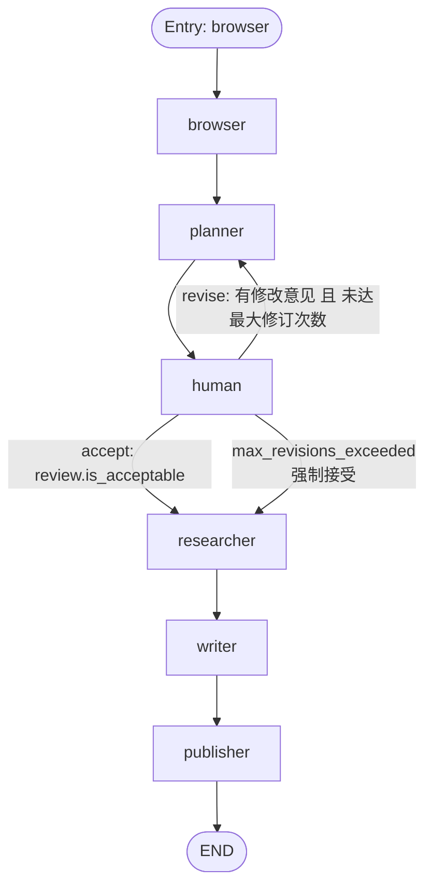
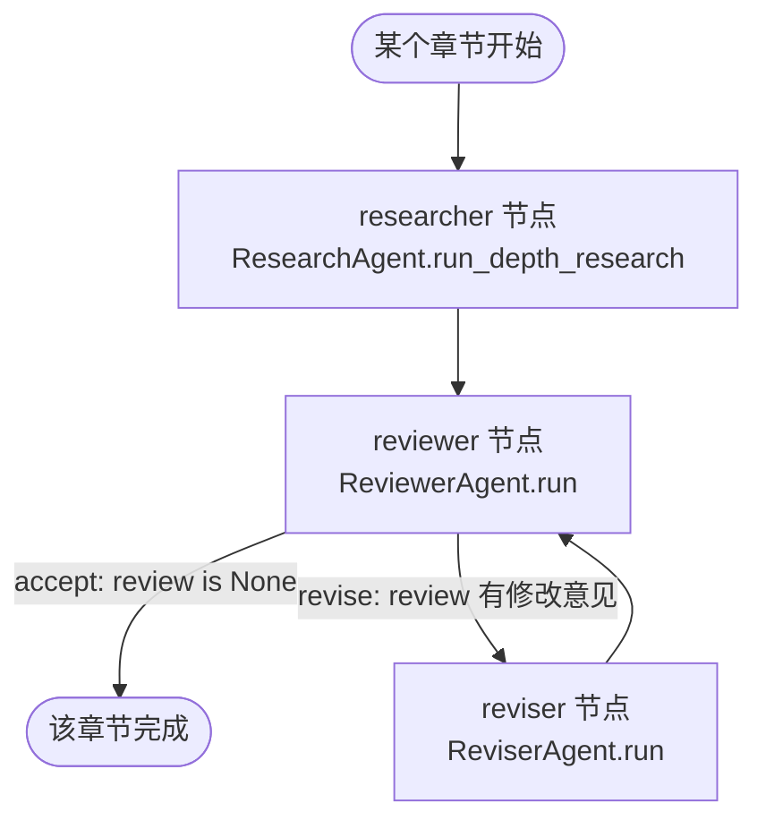
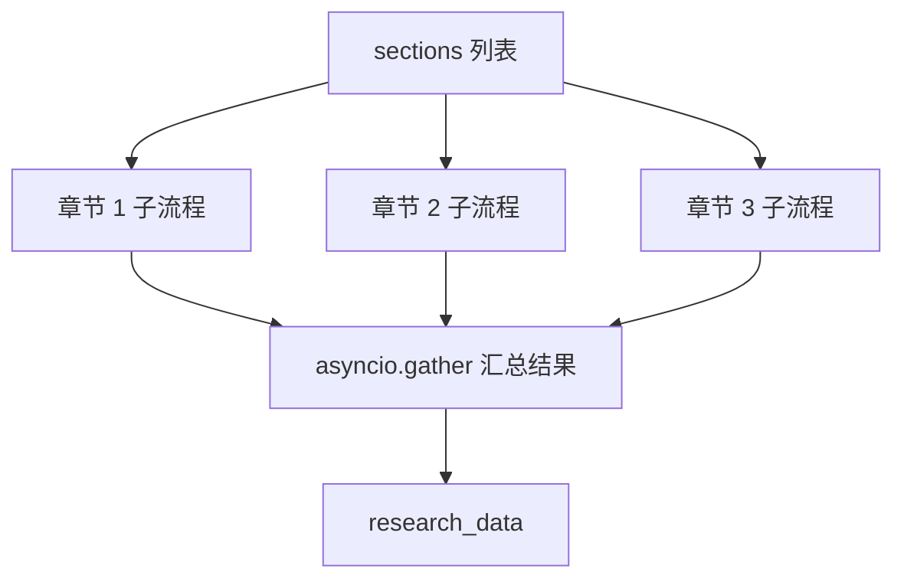
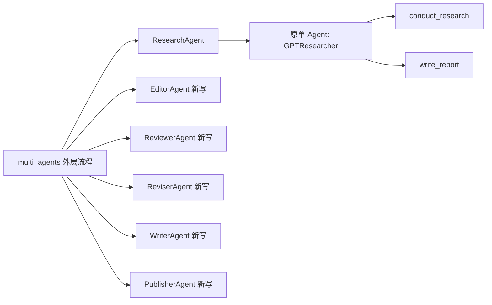

# multi_agents 多 Agent 协作流程图

本文说明 `multi_agents/` 目录中的 LangGraph 多 Agent 协作流程。这个实现不是完全替代单 Agent 的 `GPTResearcher`，而是在外层增加了一个“编辑部式”的协作流程：总编辑负责调度，研究员负责调用原来的 `GPTResearcher`，编辑负责规划大纲，审稿员和修订员负责按规范修改，最后写作者汇总并由发布者导出文件。

## 1. 顶层流程图

```mermaid
flowchart TD
    Start([开始]) --> Input[初始 state: { task }]
    Input --> Browser[browser 节点\nResearchAgent.run_initial_research]
    Browser --> Planner[planner 节点\nEditorAgent.plan_research]
    Planner --> Human[human 节点\nHumanAgent.review_plan]

    Human -->|accept: 无人工修改意见| ParallelResearch[researcher 节点\nEditorAgent.run_parallel_research]
    Human -->|revise: 有人工修改意见| Planner

    ParallelResearch --> Writer[writer 节点\nWriterAgent.run]
    Writer --> Publisher[publisher 节点\nPublisherAgent.run]
    Publisher --> End([结束: 返回最终 state])
```

简单理解：

1. `chain.ainvoke({"task": self.task}, config=config)` 启动 LangGraph。
2. 初始状态只有 `task`，也就是任务配置。
3. `browser` 先对总问题做初步研究，生成 `initial_research`。
4. `planner` 根据初步研究生成标题和章节大纲。
5. `human` 根据配置决定是否需要人工确认大纲。
6. `researcher` 对每个章节并行做深度研究。
7. `writer` 汇总章节研究结果，生成引言、结论、引用等内容。
8. `publisher` 生成最终报告，并按配置导出 markdown、pdf、docx。

## 2. 顶层节点对应关系

### 2.1 节点和方法映射

| LangGraph 节点名 | 实际调用的方法 | 作用 |
| --- | --- | --- |
| `browser` | `ResearchAgent.run_initial_research()` | 对用户总问题做一次初步研究，产出 `initial_research` |
| `planner` | `EditorAgent.plan_research()` | 根据初步研究规划报告标题和章节列表 |
| `human` | `HumanAgent.review_plan()` | 可选人工审核大纲；有反馈则回到 `planner` |
| `researcher` | `EditorAgent.run_parallel_research()` | 对每个章节启动并行子流程 |
| `writer` | `WriterAgent.run()` | 汇总章节结果，写引言、目录、结论、引用 |
| `publisher` | `PublisherAgent.run()` | 拼接最终报告并导出文件 |

### 2.2 顶层工作流（含条件边路由细节）

`ChiefEditorAgent._add_workflow_edges()` 定义了完整的边和条件路由：



对应的代码逻辑：

```python
def _add_workflow_edges(self, workflow):
    # 固定边：顺序执行
    workflow.add_edge('browser', 'planner')
    workflow.add_edge('planner', 'human')
    workflow.add_edge('researcher', 'writer')
    workflow.add_edge('writer', 'publisher')
    workflow.set_entry_point("browser")
    workflow.add_edge('publisher', END)

    # 条件边：human 节点的路由
    workflow.add_conditional_edges(
        'human',
        self._route_human_feedback,           # 路由函数
        {"accept": "researcher",               # 通过 → 进入 researcher 启动子流程
         "revise": "planner"}                  # 退回 → 回到 planner 重新规划
    )
```

### 2.3 路由函数 `_route_human_feedback`

```python
def _route_human_feedback(self, review):
    max_plan_revisions = self.task.get(
        "max_plan_revisions", DEFAULT_MAX_PLAN_REVISIONS)
    return route_human_feedback(review, max_plan_revisions)
```

它调用 `plan_review.route_human_feedback()`，逻辑是：

```text
human 节点执行完，返回 review 字典

if review["review"] == "accept":
    → 返回 "accept"  → 进入 researcher（启动并行子流程）

elif review["plan_revision_count"] >= max_plan_revisions:
    → 返回 "accept"  → 强制进入 researcher（修订次数超限）

else:
    → 返回 "revise"  → 回到 planner（重新规划大纲）
```

注意：顶层的 `researcher` 节点名字容易误解。它实际调用的是 `EditorAgent.run_parallel_research()`，真正的章节研究员、审稿员、修订员在这个方法内部的子流程里。

## 3. 每个章节的子流程图

`EditorAgent.run_parallel_research()` 会为每个 section 启动一个章节级 LangGraph 子流程。多个章节之间通过 `asyncio.gather()` 并行运行。



简单理解：

1. `ResearchAgent.run_depth_research()` 针对一个章节调用原来的 `GPTResearcher`。
2. `ReviewerAgent.run()` 如果 `follow_guidelines=false`，基本跳过审稿。
3. 如果 `follow_guidelines=true`，Reviewer 会根据 `guidelines` 检查草稿。
4. 如果 Reviewer 返回 `None`，说明章节通过。
5. 如果 Reviewer 返回修改意见，则进入 `ReviserAgent.run()`。
6. Reviser 修改后，再交给 Reviewer 审，直到通过或达到 LangGraph 自身递归限制。

## 4. 多章节并行结构



如果 `max_sections=3`，通常会有三个章节子流程并行运行。每个章节子流程都会产出一个 `draft`，最后汇总成顶层 state 里的 `research_data`。

## 5. State 是怎么一步步构造的

LangGraph 的 state 可以理解成一个不断变大的字典。每个节点读取当前 state，然后返回一个 dict，LangGraph 会把返回值合并进 state。

```mermaid
flowchart TD
    A[初始 state\n{ task }] --> B[browser 后\n{ task, initial_research }]
    B --> C[planner 后\n{ task, initial_research, title, date, sections }]
    C --> D[human 后\n增加 human_feedback, plan_revision_count]
    D --> E[researcher 后\n增加 research_data]
    E --> F[writer 后\n增加 headers, introduction, conclusion, sources]
    F --> G[publisher 后\n增加 report]
```

对应关系：

| 阶段 | 新增 state 字段 | 说明 |
| --- | --- | --- |
| 初始输入 | `task` | 任务配置，来自 `task.json` 或后端传入 query 后覆盖 |
| `browser` | `initial_research` | 对总问题的初步研究报告 |
| `planner` | `title`, `date`, `sections` | 报告标题、日期、章节大纲 |
| `human` | `human_feedback`, `plan_revision_count` | 人工反馈和大纲修改次数 |
| `researcher` | `research_data` | 每个章节的研究草稿 |
| `writer` | `headers`, `table_of_contents`, `introduction`, `conclusion`, `sources` | 最终报告的布局内容 |
| `publisher` | `report` | 最终完整报告文本 |

## 6. 哪些复用了单 Agent 系统



复用关系：

- `ResearchAgent` 复用了原来的 `GPTResearcher`，负责真正的搜索、抓取、上下文整理和章节初稿生成。
- `ChiefEditorAgent`、`EditorAgent`、`HumanAgent`、`ReviewerAgent`、`ReviserAgent`、`WriterAgent`、`PublisherAgent` 是多 Agent 外层新增角色。
- `EditorAgent`、`ReviewerAgent`、`ReviserAgent`、`WriterAgent` 虽然不复用 `GPTResearcher` 这个类，但复用了项目里的 LLM 配置和 `create_chat_completion()` 调用能力。

## 7. 一句话总结

`multi_agents` 的本质是：用 LangGraph 把多个 Agent 方法串成一个可分支、可循环、可并行的工作流；其中研究能力主要复用原来的 `GPTResearcher`，多 Agent 部分主要新增了大纲规划、人工反馈、章节并行、审稿修订、最终汇总和报告发布。